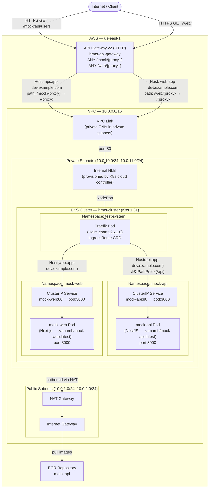

# EKS + Traefik + API Gateway

A NestJS mock API and Next.js UI deployed on AWS EKS, routed through Traefik ingress and exposed via API Gateway v2 over a private VPC Link.

---

## Live Endpoints

| Service | URL |
|---------|-----|
| **UI** (Next.js / Digital Commerce) | `https://7r0mkgh9d7.execute-api.us-east-1.amazonaws.com/web/` |
| **API** (NestJS / mock-api) | `https://7r0mkgh9d7.execute-api.us-east-1.amazonaws.com/mock/` |

---

## Architecture



---

## Traffic Flow

### API (`/mock/...`)

| Step | Component | Detail |
|------|-----------|--------|
| 1 | Client | `GET https://<api-gw>/mock/api/users` |
| 2 | API Gateway | Matches `ANY /mock/{proxy+}`, rewrites path → `/api/users`, sets `Host: api.app-dev.example.com` |
| 3 | VPC Link | Routes into the private VPC |
| 4 | Internal NLB | Forwards to Traefik NodePort |
| 5 | Traefik | Matches IngressRoute: `Host(api.app-dev.example.com) && PathPrefix(/api)` |
| 6 | mock-api | NestJS app on port `3000` returns JSON |

### UI (`/web/...`)

| Step | Component | Detail |
|------|-----------|--------|
| 1 | Client | `GET https://<api-gw>/web/` |
| 2 | API Gateway | Matches `ANY /web/{proxy+}`, rewrites path → `/`, sets `Host: web.app-dev.example.com` |
| 3 | VPC Link | Routes into the private VPC |
| 4 | Internal NLB | Forwards to Traefik NodePort |
| 5 | Traefik | Matches IngressRoute: `Host(web.app-dev.example.com)` |
| 6 | mock-web | Next.js app on port `3000` serves HTML |

---

## Prerequisites

- AWS CLI configured (`aws configure`)
- Terraform >= 1.5
- kubectl
- Docker (with buildx for multi-arch builds)

---

## Deploy

### 1. Create Infrastructure

```bash
cd terraform

# Stage 1 — EKS cluster (Kubernetes/Helm providers need this first)
terraform init
terraform apply -target=aws_eks_cluster.main -auto-approve

# Stage 2 — Node group + Traefik (CRD must exist before IngressRoute)
terraform apply -target=helm_release.traefik -auto-approve

# Stage 3 — Full apply (apps + API Gateway)
terraform apply -auto-approve
```

### 2. Build & Push Images

Both apps must be built for `linux/amd64` (EKS t3.medium nodes are x86_64).

**mock-api (NestJS)**

```bash
cd api
docker buildx build --platform linux/amd64 --target production \
  -t <dockerhub-user>/mock-api:latest --push .
```

**mock-web (Next.js)**

```bash
cd ui
docker buildx build --platform linux/amd64 \
  -t <dockerhub-user>/mock-web:latest --push .
```

Update `terraform/terraform.tfvars`:
```hcl
app_image = "<dockerhub-user>/mock-api:latest"
ui_image  = "<dockerhub-user>/mock-web:latest"
```

Then re-apply:
```bash
cd terraform && terraform apply -auto-approve
```

### 3. Configure kubectl

```bash
aws eks update-kubeconfig --region us-east-1 --name hrms-cluster
```

---

## API Endpoints

Base URL: `https://7r0mkgh9d7.execute-api.us-east-1.amazonaws.com/mock`

| Method | Path | Description |
|--------|------|-------------|
| GET | `/mock/api/users` | List all users |
| GET | `/mock/api/users/:id` | Get user by ID |
| POST | `/mock/api/users` | Create user |
| PUT | `/mock/api/users/:id` | Update user |
| DELETE | `/mock/api/users/:id` | Delete user |
| GET | `/mock/api/products` | List all products |
| GET | `/mock/api/products/:id` | Get product by ID |
| POST | `/mock/api/products` | Create product |
| PUT | `/mock/api/products/:id` | Update product |
| DELETE | `/mock/api/products/:id` | Delete product |

### Example Requests

```bash
# List users
curl https://7r0mkgh9d7.execute-api.us-east-1.amazonaws.com/mock/api/users

# List products
curl https://7r0mkgh9d7.execute-api.us-east-1.amazonaws.com/mock/api/products

# Get single user
curl https://7r0mkgh9d7.execute-api.us-east-1.amazonaws.com/mock/api/users/1

# Create user
curl -X POST https://7r0mkgh9d7.execute-api.us-east-1.amazonaws.com/mock/api/users \
  -H "Content-Type: application/json" \
  -d '{"name":"Dan Brown","email":"dan@example.com","role":"user"}'
```

---

## UI

Base URL: `https://7r0mkgh9d7.execute-api.us-east-1.amazonaws.com/web`

| Path | Description |
|------|-------------|
| `/web/` | Home page |
| `/web/products` | Products listing |
| `/web/cart` | Shopping cart |

---

## Project Structure

```
eks-traefik/
├── api/                  # NestJS mock API (port 3000)
│   ├── src/
│   ├── Dockerfile
│   └── deploy.sh
├── ui/                   # Next.js UI (port 3000)
│   ├── src/
│   ├── Dockerfile
│   └── deploy.sh
└── terraform/
    ├── vpc.tf            # VPC, subnets, IGW, NAT Gateway
    ├── eks.tf            # EKS cluster + node group + IAM
    ├── security_groups.tf
    ├── traefik.tf        # Helm release + NLB wait
    ├── ecr.tf            # ECR repository for mock-api
    ├── app.tf            # mock-api deployment + service + IngressRoute
    ├── ui.tf             # mock-web deployment + service + IngressRoute
    ├── api_gateway.tf    # HTTP API + VPC Link + routes
    ├── variables.tf
    ├── outputs.tf
    └── terraform.tfvars
```

---

## Key Infrastructure Decisions

| Decision | Rationale |
|----------|-----------|
| NLB internal-only | API Gateway VPC Link requires a private NLB; not exposed to internet directly |
| Traefik via Helm | CRD-based routing (IngressRoute) with cross-namespace support |
| API Gateway v2 HTTP | Lower cost, simpler config vs REST API; native VPC Link support |
| Single VPC Link for both apps | Both routes share the same NLB; Traefik differentiates via Host header |
| Workers in private subnets | Security best practice; egress via NAT Gateway |
| `--platform linux/amd64` | EKS t3.medium nodes are x86_64; ARM images fail to schedule |
| `overwrite:header.Host` | API Gateway strips the original Host; must explicitly set it for Traefik routing |

---

## Known Issues Fixed During Deployment

1. **Traefik chart `expose` format** — Chart v26.1.0 expects a boolean (`true`/`false`), not an object (`{default: true}`). Fixed in `terraform/traefik.tf`.
2. **Security group description encoding** — AWS rejects non-ASCII characters in SG descriptions. Em-dash (`–`) replaced with hyphen (`-`) in `terraform/security_groups.tf`.
3. **Node group bootstrap failure** — NAT Gateway must exist before the node group is created, otherwise private-subnet nodes cannot reach the EKS API server to register. Fixed by applying VPC routing before the node group.
4. **Two-stage apply required** — The Kubernetes/Helm providers cannot be configured until the EKS cluster exists, and the `IngressRoute` CRD cannot be applied until Traefik is installed. Apply order: `aws_eks_cluster.main` → `helm_release.traefik` → full apply.
5. **ARM64 image on AMD64 nodes** — Docker Hub image was ARM64-only. Rebuilt with `--platform linux/amd64` using `docker buildx`.
6. **API Gateway Host header** — API Gateway replaces the Host header with the NLB hostname. Fixed by adding `overwrite:header.Host` to each integration's `request_parameters`.

---

## Debugging & Troubleshooting

### kubectl — Cluster Overview

```bash
# Configure kubectl
aws eks update-kubeconfig --region us-east-1 --name hrms-cluster

# All pods across all namespaces
kubectl get pods -A

# Pods in each app namespace
kubectl get pods -n mock-api
kubectl get pods -n mock-web
kubectl get pods -n test-system   # Traefik
```

---

### Application Logs

**mock-api (NestJS)**
```bash
# Live logs
kubectl logs -n mock-api -l app=mock-api -f

# Last 100 lines
kubectl logs -n mock-api -l app=mock-api --tail=100

# Previous container (if pod restarted)
kubectl logs -n mock-api -l app=mock-api --previous
```

**mock-web (Next.js)**
```bash
kubectl logs -n mock-web -l app=mock-web -f
kubectl logs -n mock-web -l app=mock-web --tail=100
```

**Traefik**
```bash
# Access logs (shows every routed request with matched rule)
kubectl logs -n test-system -l app.kubernetes.io/name=traefik -f

# Last 50 lines
kubectl logs -n test-system -l app.kubernetes.io/name=traefik --tail=50
```

**API Gateway (CloudWatch)**
```bash
# Tail live API Gateway access logs
aws logs tail /aws/apigateway/hrms-api-gateway --region us-east-1 --follow

# Last 20 entries
aws logs tail /aws/apigateway/hrms-api-gateway --region us-east-1 --since 10m
```

---

### Traffic Flow Diagnostics

#### Step 1 — Verify pods are Running and Ready

```bash
kubectl get pods -n mock-api -o wide
kubectl get pods -n mock-web -o wide
kubectl get pods -n test-system -o wide
```

Expected: all pods `1/1 Running`.

#### Step 2 — Verify Services and ClusterIP

```bash
kubectl get svc -n mock-api
kubectl get svc -n mock-web
kubectl get svc -n test-system   # Traefik LoadBalancer — check EXTERNAL-IP
```

#### Step 3 — Verify Traefik IngressRoutes

```bash
# List all IngressRoutes across namespaces
kubectl get ingressroute -A

# Describe a specific route
kubectl describe ingressroute mock-api  -n mock-api
kubectl describe ingressroute mock-web  -n mock-web
```

#### Step 4 — Test connectivity inside the cluster

```bash
# Exec into a pod and curl the API service directly
kubectl run curl --image=curlimages/curl -it --rm --restart=Never -- \
  curl -s http://mock-api.mock-api.svc.cluster.local/api/users

# Curl the UI service directly
kubectl run curl --image=curlimages/curl -it --rm --restart=Never -- \
  curl -s -o /dev/null -w "%{http_code}" http://mock-web.mock-web.svc.cluster.local/
```

#### Step 5 — Verify NLB is active

```bash
# Check Traefik LoadBalancer hostname
kubectl get svc traefik -n test-system -o jsonpath='{.status.loadBalancer.ingress[0].hostname}'

# Check NLB state in AWS
aws elbv2 describe-load-balancers --region us-east-1 \
  --query 'LoadBalancers[?contains(DNSName,`ac7bcc3cc0477485881ff3b8b8fd2c87`)].{State:State.Code,Scheme:Scheme,Type:Type}'
```

#### Step 6 — Verify VPC Link is AVAILABLE

```bash
aws apigatewayv2 get-vpc-links --region us-east-1 \
  --query 'Items[].{Name:Name,Status:VpcLinkStatus,Message:VpcLinkStatusMessage}'
```

#### Step 7 — Test the full end-to-end path

```bash
# API
curl -sv https://7r0mkgh9d7.execute-api.us-east-1.amazonaws.com/mock/api/users 2>&1 | grep "< HTTP"

# UI
curl -sv https://7r0mkgh9d7.execute-api.us-east-1.amazonaws.com/web/ 2>&1 | grep "< HTTP"
```

---

### Common Issues

| Symptom | Likely Cause | Fix |
|---------|-------------|-----|
| `403 Forbidden` from API Gateway | No matching route / VPC Link not ready | Check route keys with `aws apigatewayv2 get-routes --api-id 7r0mkgh9d7`; wait for VPC Link to become `AVAILABLE` |
| `404` from Traefik | Host header mismatch | Confirm `overwrite:header.Host` matches the IngressRoute `Host()` rule |
| `ImagePullBackOff` | Wrong image platform (ARM vs AMD64) | Rebuild with `--platform linux/amd64` using `docker buildx` |
| Pod stuck in `Pending` | Insufficient node capacity | Check `kubectl describe pod <name> -n <ns>` for scheduling events |
| Pod `CrashLoopBackOff` | App startup failure | Check logs with `kubectl logs -n <ns> -l app=<name> --previous` |
| Node group `CREATE_FAILED` | NAT Gateway not ready when nodes bootstrapped | Ensure NAT Gateway and private route table exist before creating the node group |
| Traefik `IngressRoute` CRD not found | Traefik Helm chart not installed yet | Run `terraform apply -target=helm_release.traefik` first |

---

### Describe Resources

```bash
# Describe a failing pod (shows Events with error details)
kubectl describe pod -n mock-api -l app=mock-api
kubectl describe pod -n mock-web -l app=mock-web

# Describe Traefik deployment
kubectl describe deployment traefik -n test-system

# Check node health
kubectl get nodes
kubectl describe node <node-name>
```

---

### Restart / Force Re-pull

```bash
# Restart a deployment (triggers rolling update, re-pulls image)
kubectl rollout restart deployment/mock-api -n mock-api
kubectl rollout restart deployment/mock-web -n mock-web

# Watch rollout status
kubectl rollout status deployment/mock-api -n mock-api
kubectl rollout status deployment/mock-web -n mock-web
```

---

## Destroy

```bash
cd terraform
terraform destroy -auto-approve
```
