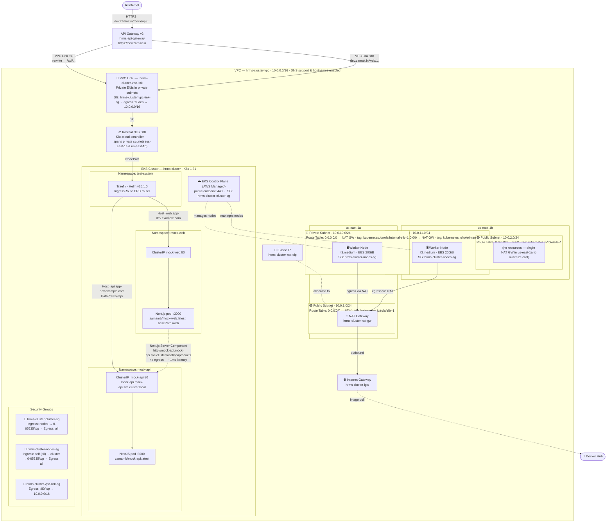

# EKS + Traefik + API Gateway

A NestJS mock API and Next.js UI deployed on AWS EKS, routed through Traefik ingress and exposed via API Gateway v2 over a private VPC Link.

---

## Live Endpoints

| Service | URL |
|---------|-----|
| **UI** (Next.js / Digital Commerce) | `https://dev.zamait.in/web` |
| **API** (NestJS / mock-api) | `https://dev.zamait.in/mock` |

---

## Architecture

### Simple Flow

```mermaid
flowchart LR
    Client(["🌐 Internet / Client"])

    subgraph DNS["DNS  —  zamait.in"]
        DOMAIN["dev.zamait.in\nCNAME → API Gateway"]
    end

    subgraph EDGE["AWS Edge"]
        ACM["🔒 ACM\n*.zamait.in  TLS 1.2"]
        APIGW["API Gateway v2\nhrms-api-gateway\ncustom domain: dev.zamait.in"]
    end

    subgraph PRIV["AWS VPC  —  Private Network  10.0.0.0/16"]
        VPCLink["🔗 VPC Link"]
        NLB["⚖️ Internal NLB  :80"]
        Traefik["Traefik Ingress\nHelm v26.1.0  ·  IngressRoute CRD"]

        subgraph K8s["EKS Cluster  —  hrms-cluster  K8s 1.31"]
            subgraph NS_API["Namespace: mock-api"]
                AppSVC["ClusterIP  mock-api:80\nmock-api.mock-api.svc.cluster.local"]
                API["NestJS  mock-api  :3000"]
            end
            subgraph NS_WEB["Namespace: mock-web"]
                UISVC["ClusterIP  mock-web:80"]
                UI["Next.js  mock-web  :3000\nbasePath /web"]
            end
        end
    end

    DockerHub(["🐳 Docker Hub"])

    Client          -->|"HTTPS"| DOMAIN
    DOMAIN          -->|"CNAME resolves"| APIGW
    ACM             -.-|"TLS termination"| APIGW
    APIGW           -->|"ANY /mock/{proxy+}\nrewrite → /{proxy}"| VPCLink
    APIGW           -->|"ANY /web/{proxy+}"| VPCLink
    VPCLink         -->|":80"| NLB
    NLB             -->|"NodePort"| Traefik
    Traefik         -->|"Host=api.*  PathPrefix=/api"| AppSVC
    AppSVC          --> API
    Traefik         -->|"Host=web.*"| UISVC
    UISVC           --> UI
    UI              -.->|"Next.js Server Component\nGET mock-api.mock-api.svc.cluster.local/api/products\nno egress  ·  ~1ms"| AppSVC
    K8s             -.->|"image pull  via NAT"| DockerHub
```



---

### Network Topology



---

## Traffic Flow

### API (`/mock/...`)

| Step | Component | Detail |
|------|-----------|--------|
| 1 | Client | `GET https://dev.zamait.in/mock/api/users` |
| 2 | API Gateway | Matches `ANY /mock/{proxy+}`, rewrites path → `/api/users`, sets `Host: api.app-dev.example.com` |
| 3 | VPC Link | Routes into the private VPC |
| 4 | Internal NLB | Forwards to Traefik NodePort |
| 5 | Traefik | Matches IngressRoute: `Host(api.app-dev.example.com) && PathPrefix(/api)` |
| 6 | mock-api | NestJS app on port `3000` returns JSON |

### UI (`/web/...`)

| Step | Component | Detail |
|------|-----------|--------|
| 1 | Client | `GET https://dev.zamait.in/web/products` |
| 2 | API Gateway | Matches `ANY /web/{proxy+}`, forwards full path unchanged, sets `Host: web.app-dev.example.com` |
| 3 | VPC Link | Routes into the private VPC |
| 4 | Internal NLB | Forwards to Traefik NodePort |
| 5 | Traefik | Matches IngressRoute: `Host(web.app-dev.example.com)` |
| 6 | mock-web | Next.js app (basePath `/web`) on port `3000` serves HTML |

### Products Page — Internal API Call

The `/web/products` page fetches live data **inside the cluster** without going through API Gateway:

```
Next.js Server Component  →  http://mock-api.mock-api.svc.cluster.local/api/products
```

No egress, no API Gateway cost, ~1 ms pod-to-pod latency.

---

## Prerequisites

| Tool | Purpose |
|------|---------|
| AWS CLI (`aws configure`) | Provision infra, update kubeconfig |
| Terraform ≥ 1.5 | Infrastructure as code |
| kubectl | Manage Kubernetes resources |
| Docker with buildx | Build multi-arch images |
| jq | Used by `import.sh` |
| terraformer | Used by `import.sh` (`brew install terraformer`) |

---

## Scripts Reference

All scripts are self-contained and read configuration from `terraform/terraform.tfvars`.

### `deploy-k8s.sh` — Build, push & deploy to EKS

```
Usage: ./deploy-k8s.sh [OPTIONS]

  --api            Deploy API only  (mock-api)
  --ui             Deploy UI only   (mock-web)
  --skip-build     Skip Docker build/push; restart existing pods only
  --tag <tag>      Docker image tag          (default: latest)
  --cluster <name> EKS cluster name          (default: hrms-cluster)
  --region <name>  AWS region                (default: us-east-1)
  --username <u>   Docker Hub username       (default: $DOCKERHUB_USERNAME)
```

```bash
# Deploy both UI and API (build → push → rollout)
DOCKERHUB_USERNAME=zamamb ./deploy-k8s.sh

# Deploy UI only
DOCKERHUB_USERNAME=zamamb ./deploy-k8s.sh --ui

# Deploy API only with a specific tag
DOCKERHUB_USERNAME=zamamb ./deploy-k8s.sh --api --tag v1.2.0

# Restart pods only (no rebuild — use current image)
./deploy-k8s.sh --skip-build

# Override cluster and region
./deploy-k8s.sh --skip-build --cluster my-cluster --region eu-west-1
```

What it does: **Build** image → **Push** to Docker Hub → **`aws eks update-kubeconfig`** → **`kubectl rollout restart`** → **Watch rollout status** → **Print pod summary**.

---

### `terraform/create.sh` — Provision the full stack

Three-stage apply required by provider dependency ordering:

```bash
cd terraform
bash create.sh
```

| Stage | Resources | Why |
|-------|-----------|-----|
| 1 | EKS cluster, VPC, NAT Gateway, IAM | K8s/Helm providers need the cluster endpoint first |
| 2 | Traefik Helm release | Installs IngressRoute CRD before apps reference it |
| 3 | Full apply | Apps, API Gateway, IngressRoutes, custom domain |

---

### `terraform/cleanup.sh` — Tear down the full stack

Three-stage destroy to avoid dependency errors:

```bash
cd terraform
bash cleanup.sh
```

| Stage | Resources | Why |
|-------|-----------|-----|
| 1 | API Gateway resources | Must go before the NLB is deleted (data source would fail) |
| 2 | K8s workloads + Traefik | Removing the LoadBalancer Service triggers NLB deletion |
| 3 | Full destroy | EKS, VPC, IAM, remaining AWS resources |

---

### `terraform/import.sh` — Import live AWS resources into Terraform state

Used by `cleanup.sh`. Can also be run standalone to reconcile state against live AWS.

```bash
cd terraform
bash import.sh            # discover and import all resources
bash import.sh --dry-run  # print import commands without executing
```

Phases:
1. **ACM certificate import** — prompts for `cert.pem`, `privkey.pem`, `chain.pem` for `*.zamait.in`; writes the ARN back to `terraform.tfvars`
2. **Terraformer scan** — discovers VPC, subnets, IAM, EKS via live AWS account
3. **`terraform import`** — imports all discovered resources into local state
4. **Refresh-only apply** — reconciles any attribute drift

Requires: `terraformer` (`brew install terraformer`), `jq`, `aws`.

---

### `terraform/reset.sh` — Wipe local state and reprovision from scratch

```bash
cd terraform
bash reset.sh
```

Removes `.terraform/`, `terraform.tfstate`, `terraform.tfstate.backup`, then calls `create.sh`. **Use with caution** — only after a successful `terraform destroy` or on a clean environment.

---

### `api/deploy.sh` — Build & push mock-api image

```bash
cd api
DOCKERHUB_USERNAME=zamamb bash deploy.sh

# Custom tag
IMAGE_TAG=v1.2.0 DOCKERHUB_USERNAME=zamamb bash deploy.sh
```

Builds for `linux/amd64` (required for EKS t3.medium x86_64 nodes) and pushes to `zamamb/mock-api:<tag>`.

---

### `ui/deploy.sh` — Build & push mock-web image

```bash
cd ui
DOCKERHUB_USERNAME=zamamb bash deploy.sh

# Custom tag
IMAGE_TAG=v1.2.0 DOCKERHUB_USERNAME=zamamb bash deploy.sh
```

Builds Next.js standalone image for `linux/amd64` and pushes to `zamamb/mock-web:<tag>`.

---

## Typical Workflows

### First-time setup

```bash
# 1. Provision infrastructure
cd terraform && bash create.sh

# 2. Build and deploy both apps
cd ..
DOCKERHUB_USERNAME=zamamb ./deploy-k8s.sh
```

### Deploy code changes

```bash
# Both apps
DOCKERHUB_USERNAME=zamamb ./deploy-k8s.sh

# UI only (faster)
DOCKERHUB_USERNAME=zamamb ./deploy-k8s.sh --ui

# API only
DOCKERHUB_USERNAME=zamamb ./deploy-k8s.sh --api
```

### Restart pods without rebuilding

```bash
./deploy-k8s.sh --skip-build
./deploy-k8s.sh --skip-build --ui
```

### Import existing AWS resources into state

```bash
cd terraform && bash import.sh --dry-run   # preview
cd terraform && bash import.sh             # execute
```

### Tear down everything

```bash
cd terraform && bash cleanup.sh
```

---

## API Endpoints

Base URL: `https://dev.zamait.in/mock`

| Method | Path | Description |
|--------|------|-------------|
| GET | `/mock/api/users` | List all users |
| GET | `/mock/api/users/:id` | Get user by ID |
| POST | `/mock/api/users` | Create user |
| PUT | `/mock/api/users/:id` | Update user |
| DELETE | `/mock/api/users/:id` | Delete user |
| GET | `/mock/api/products` | List all products |
| GET | `/mock/api/products/:id` | Get product by ID |
| POST | `/mock/api/products` | Create product |
| PUT | `/mock/api/products/:id` | Update product |
| DELETE | `/mock/api/products/:id` | Delete product |

```bash
curl https://dev.zamait.in/mock/api/users
curl https://dev.zamait.in/mock/api/products
curl https://dev.zamait.in/mock/api/users/1
curl -X POST https://dev.zamait.in/mock/api/users \
  -H "Content-Type: application/json" \
  -d '{"name":"Dan Brown","email":"dan@example.com","role":"user"}'
```

---

## UI Pages

Base URL: `https://dev.zamait.in/web`

| Path | Description |
|------|-------------|
| `/web` | Home — ShopNow landing page |
| `/web/products` | Products table — live data from internal API |
| `/web/cart` | Shopping cart |

### Products API — `API_URL` environment variable

The `/web/products` page is a Next.js Server Component. It resolves the API base URL at runtime using the `API_URL` environment variable:

```
API_URL set     →  ${API_URL}/api/products
API_URL not set →  http://mock-api.mock-api.svc.cluster.local/api/products  (default)
```

**Default (recommended):** leave `API_URL` unset. The pod calls the mock-api ClusterIP directly — no egress, no API Gateway cost, ~1 ms latency.

**Override via `API_URL`:** set this when you want the UI to call a different API endpoint (e.g. a staging URL or the public API Gateway URL for local development).

#### Option 1 — Set in `terraform/ui.tf` (persisted in infra)

Add an `env` block inside the `container` spec:

```hcl
env {
  name  = "API_URL"
  value = "https://dev.zamait.in/mock"
}
```

Then re-apply:

```bash
cd terraform && terraform apply
```

#### Option 2 — Patch the running deployment (temporary)

```bash
kubectl set env deployment/mock-web -n mock-web API_URL=https://dev.zamait.in/mock
kubectl rollout status deployment/mock-web -n mock-web
```

Remove the override to revert to the internal default:

```bash
kubectl set env deployment/mock-web -n mock-web API_URL-
```

#### Option 3 — Local development (`.env.local`)

Create `ui/.env.local` (never committed):

```bash
API_URL=http://localhost:3001
```

Then run `npm run dev` — Next.js picks up `.env.local` automatically.

---

## Project Structure

```
eks-apigateway-traefik-nlb/
├── deploy-k8s.sh             # Build, push & roll out both apps to EKS
├── api/                      # NestJS mock API (port 3000)
│   ├── src/
│   ├── Dockerfile
│   └── deploy.sh             # Build & push zamamb/mock-api
├── ui/                       # Next.js UI (port 3000, basePath /web)
│   ├── src/
│   ├── Dockerfile
│   ├── deploy.sh             # Build & push zamamb/mock-web
│   └── run.sh
└── terraform/
    ├── create.sh             # Three-stage terraform apply
    ├── cleanup.sh            # Three-stage terraform destroy
    ├── import.sh             # Terraformer-based state import + ACM cert import
    ├── reset.sh              # Wipe state and reprovision from scratch
    ├── vpc.tf                # VPC, subnets, IGW, NAT Gateway
    ├── eks.tf                # EKS cluster + node group + IAM
    ├── security_groups.tf
    ├── traefik.tf            # Helm release + NLB wait
    ├── app.tf                # mock-api deployment + service + IngressRoute
    ├── ui.tf                 # mock-web deployment + service + IngressRoute
    ├── api_gateway.tf        # HTTP API + VPC Link + routes + custom domain
    ├── variables.tf
    ├── outputs.tf
    └── terraform.tfvars
```

---

## Key Infrastructure Decisions

| Decision | Rationale |
|----------|-----------|
| NLB internal-only | API Gateway VPC Link requires a private NLB; not exposed to internet directly |
| Traefik via Helm | CRD-based routing (IngressRoute) with cross-namespace support |
| API Gateway v2 HTTP | Lower cost, simpler config vs REST API; native VPC Link support |
| Single VPC Link for both apps | Both routes share the same NLB; Traefik differentiates via Host header |
| Workers in private subnets | Security best practice; egress via NAT Gateway |
| `--platform linux/amd64` | EKS t3.medium nodes are x86_64; ARM images fail to schedule |
| `overwrite:header.Host` | API Gateway strips the original Host; must explicitly set it for Traefik routing |
| UI path not rewritten | Next.js `basePath: '/web'` needs the `/web` prefix intact; API GW forwards the full path |
| Server Component for products | Fetches from internal K8s service (`mock-api.mock-api.svc.cluster.local`) — no API GW cost, ~1 ms latency |
| Wildcard ACM cert (`*.zamait.in`) | One imported certificate covers all subdomains |
| Images from Docker Hub | Simpler than ECR for public/shared images; no registry auth needed on nodes |

---

## Debugging & Troubleshooting

### Configure kubectl

```bash
aws eks update-kubeconfig --region us-east-1 --name hrms-cluster
# or use deploy-k8s.sh --skip-build which runs this automatically
```

### Pod overview

```bash
kubectl get pods -A
kubectl get pods -n mock-api
kubectl get pods -n mock-web
kubectl get pods -n test-system   # Traefik
```

### Application logs

```bash
# mock-api
kubectl logs -n mock-api -l app=mock-api -f
kubectl logs -n mock-api -l app=mock-api --tail=100

# mock-web
kubectl logs -n mock-web -l app=mock-web -f
kubectl logs -n mock-web -l app=mock-web --tail=100

# Traefik
kubectl logs -n test-system -l app.kubernetes.io/name=traefik -f

# API Gateway (CloudWatch)
aws logs tail /aws/apigateway/hrms-api-gateway --region us-east-1 --follow
aws logs tail /aws/apigateway/hrms-api-gateway --region us-east-1 --since 10m
```

### Traffic flow diagnostics

```bash
# 1. Pods running and ready?
kubectl get pods -n mock-api -o wide
kubectl get pods -n mock-web -o wide
kubectl get pods -n test-system -o wide

# 2. Services and ClusterIPs
kubectl get svc -n mock-api
kubectl get svc -n mock-web
kubectl get svc -n test-system

# 3. IngressRoutes
kubectl get ingressroute -A
kubectl describe ingressroute mock-api -n mock-api
kubectl describe ingressroute mock-web -n mock-web

# 4. Connectivity inside cluster
kubectl run curl --image=curlimages/curl -it --rm --restart=Never -- \
  curl -s http://mock-api.mock-api.svc.cluster.local/api/products

# 5. NLB active?
kubectl get svc traefik -n test-system -o jsonpath='{.status.loadBalancer.ingress[0].hostname}'

# 6. VPC Link available?
aws apigatewayv2 get-vpc-links --region us-east-1 \
  --query 'Items[].{Name:Name,Status:VpcLinkStatus}'

# 7. End-to-end
curl -sv https://dev.zamait.in/mock/api/products 2>&1 | grep "< HTTP"
curl -sv https://dev.zamait.in/web/products       2>&1 | grep "< HTTP"
```

### Common issues

| Symptom | Likely Cause | Fix |
|---------|-------------|-----|
| `403 Forbidden` from API Gateway | No matching route / VPC Link not ready | Check routes with `aws apigatewayv2 get-routes --api-id <id>`; wait for VPC Link `AVAILABLE` |
| `404` from Traefik | Host header mismatch | Confirm `overwrite:header.Host` matches the IngressRoute `Host()` rule |
| `ImagePullBackOff` | Wrong image platform (ARM vs AMD64) | Rebuild with `--platform linux/amd64` via `deploy-k8s.sh` or `api/deploy.sh` |
| Pod stuck in `Pending` | Insufficient node capacity | `kubectl describe pod <name> -n <ns>` → check Events |
| Pod `CrashLoopBackOff` | App startup failure | `kubectl logs -n <ns> -l app=<name> --previous` |
| Node group `CREATE_FAILED` | NAT Gateway not ready when nodes bootstrapped | Use `create.sh` which stages the apply correctly |
| Traefik `IngressRoute` CRD not found | Traefik not installed yet | `create.sh` stage 2 installs Traefik before apps |

### Describe resources

```bash
kubectl describe pod -n mock-api -l app=mock-api
kubectl describe pod -n mock-web -l app=mock-web
kubectl describe deployment traefik -n test-system
kubectl get nodes
kubectl describe node <node-name>
```

### Restart / force re-pull

```bash
# Using deploy-k8s.sh (recommended)
./deploy-k8s.sh --skip-build          # restart both
./deploy-k8s.sh --skip-build --ui     # restart UI only
./deploy-k8s.sh --skip-build --api    # restart API only

# Direct kubectl
kubectl rollout restart deployment/mock-api -n mock-api
kubectl rollout restart deployment/mock-web -n mock-web
kubectl rollout status  deployment/mock-api -n mock-api
kubectl rollout status  deployment/mock-web -n mock-web
```
