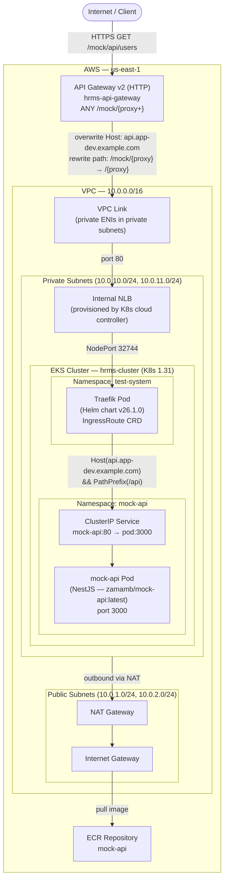

# EKS + Traefik + API Gateway

A NestJS mock API deployed on AWS EKS, routed through Traefik ingress and exposed via API Gateway v2 over a private VPC Link.

---

## Architecture



---

## Traffic Flow

| Step | Component | Detail |
|------|-----------|--------|
| 1 | Client | `GET https://<api-gw>/mock/api/users` |
| 2 | API Gateway | Matches route `ANY /mock/{proxy+}`, rewrites path to `/api/users`, sets `Host: api.app-dev.example.com` |
| 3 | VPC Link | Routes request into the private VPC via ENIs in private subnets |
| 4 | Internal NLB | Forwards to Traefik NodePort (`32744 → 8000`) |
| 5 | Traefik | Matches IngressRoute: `Host(api.app-dev.example.com) && PathPrefix(/api)` |
| 6 | mock-api | NestJS app handles request on port `3000`, returns JSON |

---

## Prerequisites

- AWS CLI configured (`aws configure`)
- Terraform >= 1.5
- kubectl
- Docker (with buildx for multi-arch builds)

---

## Deploy

### 1. Create Infrastructure

```bash
cd terraform

# Stage 1 — EKS cluster (Kubernetes/Helm providers need this first)
terraform init
terraform apply -target=aws_eks_cluster.main -auto-approve

# Stage 2 — Node group + Traefik (CRD must exist before IngressRoute)
terraform apply -target=helm_release.traefik -auto-approve

# Stage 3 — Full apply (app deployment + API Gateway)
terraform apply -auto-approve
```

### 2. Build & Push the Application Image

**Option A — Push to Docker Hub (linux/amd64)**

```bash
cd api
docker buildx build --platform linux/amd64 --target production \
  -t <your-dockerhub-user>/mock-api:latest --push .
```

Update `terraform/terraform.tfvars`:
```hcl
app_image = "<your-dockerhub-user>/mock-api:latest"
```

**Option B — Push to ECR**

```bash
# Authenticate
aws ecr get-login-password --region us-east-1 | \
  docker login --username AWS --password-stdin \
  <account-id>.dkr.ecr.us-east-1.amazonaws.com

# Build and push (amd64 required for t3/t3a instances)
cd api
docker buildx build --platform linux/amd64 --target production \
  -t <account-id>.dkr.ecr.us-east-1.amazonaws.com/mock-api:latest --push .
```

Update `terraform/terraform.tfvars`:
```hcl
app_image = "<account-id>.dkr.ecr.us-east-1.amazonaws.com/mock-api:latest"
```

Then re-apply:
```bash
cd terraform
terraform apply -auto-approve
```

### 3. Configure kubectl

```bash
aws eks update-kubeconfig --region us-east-1 --name hrms-cluster
```

---

## API Endpoints

Base URL: `https://7r0mkgh9d7.execute-api.us-east-1.amazonaws.com/mock`

| Method | Path | Description |
|--------|------|-------------|
| GET | `/mock/api/users` | List all users |
| GET | `/mock/api/users/:id` | Get user by ID |
| POST | `/mock/api/users` | Create user |
| PUT | `/mock/api/users/:id` | Update user |
| DELETE | `/mock/api/users/:id` | Delete user |
| GET | `/mock/api/products` | List all products |
| GET | `/mock/api/products/:id` | Get product by ID |
| POST | `/mock/api/products` | Create product |
| PUT | `/mock/api/products/:id` | Update product |
| DELETE | `/mock/api/products/:id` | Delete product |

### Example Requests

```bash
# List users
curl https://7r0mkgh9d7.execute-api.us-east-1.amazonaws.com/mock/api/users

# List products
curl https://7r0mkgh9d7.execute-api.us-east-1.amazonaws.com/mock/api/products

# Get single user
curl https://7r0mkgh9d7.execute-api.us-east-1.amazonaws.com/mock/api/users/1

# Create user
curl -X POST https://7r0mkgh9d7.execute-api.us-east-1.amazonaws.com/mock/api/users \
  -H "Content-Type: application/json" \
  -d '{"name":"Dan Brown","email":"dan@example.com","role":"user"}'
```

---

## Key Infrastructure Decisions

| Decision | Rationale |
|----------|-----------|
| NLB internal-only | API Gateway VPC Link requires a private NLB; not exposed to internet directly |
| Traefik via Helm | CRD-based routing (IngressRoute) with cross-namespace support |
| API Gateway v2 HTTP | Lower cost, simpler config vs REST API; native VPC Link support |
| Workers in private subnets | Security best practice; egress via NAT Gateway |
| `--platform linux/amd64` | EKS t3.medium nodes are x86_64; ARM images fail to schedule |
| `overwrite:header.Host` | API Gateway strips the original Host; must explicitly set it for Traefik routing |

---

## Known Issues Fixed During Deployment

1. **Traefik chart `expose` format** — Chart v26.1.0 expects a boolean (`true`/`false`), not an object (`{default: true}`). Fixed in `terraform/traefik.tf`.
2. **Security group description encoding** — AWS rejects non-ASCII characters in SG descriptions. Em-dash (`–`) replaced with hyphen (`-`) in `terraform/security_groups.tf`.
3. **Node group bootstrap failure** — NAT Gateway must exist before the node group is created, otherwise private-subnet nodes cannot reach the EKS API server to register. Fixed by applying VPC routing before the node group.
4. **Two-stage apply required** — The Kubernetes/Helm providers cannot be configured until the EKS cluster exists, and the `IngressRoute` CRD cannot be applied until Traefik is installed. Apply order: `aws_eks_cluster.main` → `helm_release.traefik` → full apply.

---

## Destroy

```bash
cd terraform
terraform destroy -auto-approve
```
